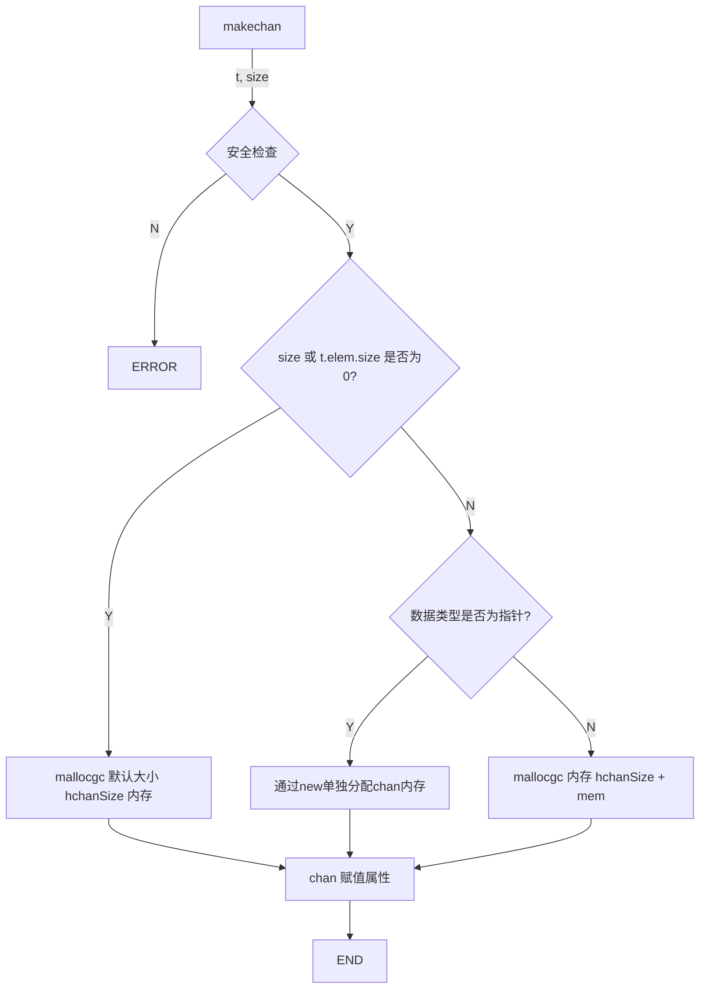
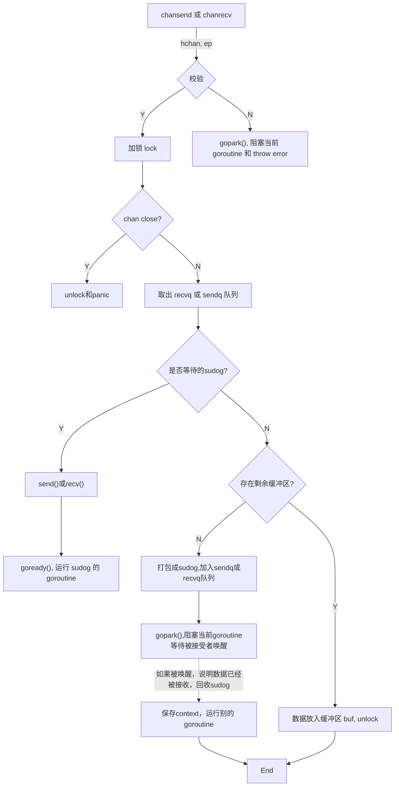
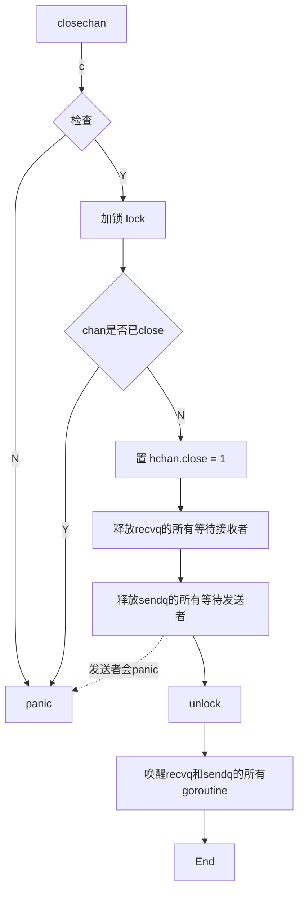

#### 01.chan 的数据结构：
golang 中 chan 的源码在 src/runtime/chan.go 文件中，`hchan` 则为 chan 的结构体

`hchan:`
```go
type hchan struct {
    qcount   uint // 当前缓存数据的总量  
    dataqsiz uint // 缓存数据的容量      
    buf      unsafe.Pointer // 缓存数据，为一个循环数组，容量大小为 dataqsiz，当前大小为 qcount
    elemsize uint16 // 数据类型的大小，比如 int 为 4
    closed   uint32 // 标记是否关闭
    elemtype *_type // 数据的类型
    sendx    uint  // 发送队列 sendq 的长度
    recvx    uint  // 接收队列 recvq 的长度
    recvq    waitq // 阻塞的接收 goroutine 的队列
    sendq    waitq // 阻塞的发送 goroutine 的队列
    lock mutex     // 锁，用于并发控制队列操作
}
``` 

`waitq:`

```go
type waitq struct {
    first *sudog
    last  *sudog
}
```
**waitq 为双向链表，sudog 代表一个封装的 goroutine，其参数 g 为 goroutine 实例结，构如下图：**


---

#### 02. 新建 chan：
在 go 中，通过如下代码创建 chan
```go
c := make(chan int, 4)
```
以上代码，对应的是源码:
```go
func makechan(t *chantype, size int) *hchan
```
逻辑流程如下:


```go
func makechan(t *chantype, size int) *hchan {
	elem := t.elem
	// 安全检查，数据项大小不超过 16K
	if elem.size >= 1<<16 {
		throw("makechan: invalid channel element type")
	}
	if hchanSize%maxAlign != 0 || elem.align > maxAlign {
		throw("makechan: bad alignment")
	}
	// 获取要分配的内存
	mem, overflow := math.MulUintptr(elem.size, uintptr(size))
	if overflow || mem > maxAlloc-hchanSize || size < 0 {
		panic(plainError("makechan: size out of range"))
	}
	var c *hchan
	switch {
	case mem == 0:
		// size 为 0 的情况，分配 hchan 结构体大小的内存，64位系统为 96 Byte.
		c = (*hchan)(mallocgc(hchanSize, nil, true))
		c.buf = c.raceaddr()
	case elem.kind&kindNoPointers != 0:
		// 数据项不为指针类型，调用 mallocgc 一次性分配内存大小，hchan 结构体大小 + 数据总量大小
		c = (*hchan)(mallocgc(hchanSize+mem, nil, true))
		c.buf = add(unsafe.Pointer(c), hchanSize)
	default:
		// 数据项为指针类型，hchan 和 buf 分开分配内存，GC 中指针类型判断 reachable and unreadchable.
		c = new(hchan)
		c.buf = mallocgc(mem, elem, true)
	}
	// chan 赋值属性, 数据项大小、数据项类型、缓存数据的容量
	c.elemsize = uint16(elem.size)
	c.elemtype = elem
	c.dataqsiz = uint(size)
	return c
}
```

---

#### 03.读写chan
在 go 中，写入 chan 的代码如下:
```go
v := 1
c := make(chan int)
c <- v
```
读取 chan 的代码如下:
```go
var v int
c := make(chan int)
c -> v
```
`c <- v` 操作对应的源码为 runtime 中的
```go
func chansend(c *hchan, ep unsafe.Pointer, block bool, callerpc uintptr) bool
```
而 `c -> v` 操作对应源码为 runtime 中的
```go
func chanrecv(c *hchan, ep unsafe.Pointer, block bool) (selected, received bool)
```

其中 c 为 chansend 的 c, v 的地址为 chansend 的 ep.

逻辑流程如下:


由于发送和接收的逻辑都是差不多的，所以这里就直接放上发送的逻辑代码来分析就好了

```go
func chansend(c *hchan, ep unsafe.Pointer, block bool, callerpc uintptr) bool {
    // 校验
    if c == nil {
        if !block {
            return false
        }
        // 参数异常，block == true, 进行阻塞 goroutine.
        gopark(nil, nil, waitReasonChanSendNilChan, traceEvGoStop, 2)
        throw("unreachable")
    }

    if debugChan {
        print("chansend: chan=", c, "\n")
    }

    if raceenabled {
        racereadpc(c.raceaddr(), callerpc, funcPC(chansend))
    }
    
    if !block && c.closed == 0 && ((c.dataqsiz == 0 && c.recvq.first == nil) ||
        (c.dataqsiz > 0 && c.qcount == c.dataqsiz)) {
        return false
    }

    var t0 int64
    if blockprofilerate > 0 {
        t0 = cputicks()
    }
    
    // 加锁，并发读写控制
    lock(&c.lock)

    // 查看 chan 是否关闭
    if c.closed != 0 {
        unlock(&c.lock)
        panic(plainError("send on closed channel"))
    }
    
    // 从等待接收列队 recvq 中试图获取获取封装的 goroutine sudog.
    if sg := c.recvq.dequeue(); sg != nil {
        // 找到等待接收 chan 的 goroutine sudog，直接发送 value 给接收者，并通过 goready() 唤醒接受者 goroutine
        send(c, sg, ep, func() { unlock(&c.lock) }, 3)
        return true
    }

    // 查看查看缓存空间是否 buf 是否还有剩余
    if c.qcount < c.dataqsiz {
        // 将数据移动到 qp 中并放入 chan 缓存，sendx++
        qp := chanbuf(c, c.sendx)
        if raceenabled {
            raceacquire(qp)
            racerelease(qp)
        }
        typedmemmove(c.elemtype, qp, ep)
        c.sendx++
        if c.sendx == c.dataqsiz {
            c.sendx = 0
        }
        c.qcount++
        unlock(&c.lock)
        return true
    }
    
    // chan 如果为非阻塞，unlock 后直接返回
    if !block {
        unlock(&c.lock)
        return false
    }
    
    // 将当前 goroutine 封装 sudog，并放入到等待发送队列 sendq 中
    gp := getg()
    mysg := acquireSudog()
    mysg.releasetime = 0
    if t0 != 0 {
        mysg.releasetime = -1
    }
    
    mysg.elem = ep
    mysg.waitlink = nil
    mysg.g = gp
    mysg.isSelect = false
    mysg.c = c
    gp.waiting = mysg
    gp.param = nil
    c.sendq.enqueue(mysg)
    // 阻塞当前 goroutine，等待被接受者 chanrecv() 的唤醒
    goparkunlock(&c.lock, waitReasonChanSend, traceEvGoBlockSend, 3)
    
    // KeepAlive 方法，由于 GC 的缘故，而调用
    KeepAlive(ep)

    // goroutine 被唤醒，重置 gorotuine 状态 和 sudog
    if mysg != gp.waiting {
        throw("G waiting list is corrupted")
    }
    gp.waiting = nil
    if gp.param == nil {
        if c.closed == 0 {
            throw("chansend: spurious wakeup")
        }
        panic(plainError("send on closed channel"))
    }
    gp.param = nil
    if mysg.releasetime > 0 {
        blockevent(mysg.releasetime-t0, 2)
    }
    mysg.c = nil
    releaseSudog(mysg)
    return true
}
```
**代码的部分详解：**

`gopark`：M(工作线程) 会保存 goroutine 的上下文，而调度器会让当前工作线程线程 M 绑定执行其他的 goroutine.

`KeepAlive(ep)`: 由于 GC 的机制，当 ep 不再被上下文引用的时候，GC 会主动回收 eq，导致 buf 被回收，所以调用 KeepAlive，告诉 GC 不需要对 eq 变量进行内存回收，具体可以查看 runtime.SetFinalizer 方法部分有详细介绍.

`唤醒`：goroutine 会在 chanrecv 这个 chan 接收接收函数中，从 hchan.sendq 被取出，执行 goready(), 通知调度器去唤醒，然后放入 P(逻辑处理器) 的执行等待队列中，等待被下一次调用.

`send()/recv()`: 通过 `memmove()` 的方式从发送方`拷贝` buf 到接收方.

---

下面我们通过一个使用channel做生产/消费的模型来试图分解一下 chan 的步骤：
```go
func main(){
    //初始化任务队列 channel
    ch := make(chan Data, 4)
    //生产者往channel丢数据
    for _, task := range  {
        ch <- task
    }
    //初始化消费者
    for i := 0; i< ConsumerNum; i++ {
        go consumer(ch)
    }
    ...
}

// 消费者
func consumer(ch chan Data){
    for {
        //收取任务并处理
        data := <- ch
        process(data)
    }
}
```

从 main 函数开始，golang 就会开启一个 goroutine 来执行代码，我们可以将其记作生产者 G'p, 代码中 `go consumer` 标记 consumer 函数也开启一个 goroutine 来进行，我们记其为消费者 G'c.

* **初始化任务队列channel**
此时会在堆区域分配一块内存，用于存储 hchan 结构体和 buf 的缓存数据。hchan.buf指向一个大小为4的数组，并且hchan.sendx、hchan.recvx置0，hchan.dataqsiz置4。

* **生产者往channel丢数据**
G'p 往 ch 发送数据的时候，会执行 lock(&hchan.lock) 对 buf 加锁，把要发送的数据拷贝到 buf 里，hchan.sendx++，之后 unlock(hchan.lock) 释放锁。

* **消费者执行消费行为**
G'c 从 ch 中获取数据的时候，会执行 lock(&hchan.lock) 对 buf 加锁，将 buf 里面的一条数据拷贝到接收变量 data 对应的空间中，hchan.recvx++，之后释放锁。

----

#### 0.4 关闭 chan

在 go 中，关闭 chan 的代码如下:
```
ch := make(chan int ,10)
close(ch)
```
`close(ch)` 对应的runtime的函数:
```
func closechan(c *hchan)
```
逻辑流程如下:



```go
func closechan(c *hchan) {
    // 检查，chan 是否为空
    if c == nil {
        panic(plainError("close of nil channel"))
    }

    // 加锁，防止资源竞争
    lock(&c.lock)
    
    // chan 如果已关闭，则 panic
    if c.closed != 0 {
        unlock(&c.lock)
        panic(plainError("close of closed channel"))
    }

    if raceenabled {
        callerpc := getcallerpc()
        racewritepc(c.raceaddr(), callerpc, funcPC(closechan))
        racerelease(c.raceaddr())
    }
    
    // 置 hchan.close = 1, 标记已关闭
    c.closed = 1
    
    var glist gList
    
    // 释放recvq的所有等待接收者
    for {
        sg := c.recvq.dequeue()
        if sg == nil {
            break
        }
        if sg.elem != nil {
            typedmemclr(c.elemtype, sg.elem)
            sg.elem = nil
        }
        if sg.releasetime != 0 {
            sg.releasetime = cputicks()
        }
        gp := sg.g
        gp.param = nil
        if raceenabled {
            raceacquireg(gp, c.raceaddr())
        }
        glist.push(gp)
    }
    
    // 释放sendq的所有等待发送者
    for {
        sg := c.sendq.dequeue()
        if sg == nil {
            break
        }
        sg.elem = nil
        if sg.releasetime != 0 {
            sg.releasetime = cputicks()
        }
        gp := sg.g
        gp.param = nil
        if raceenabled {
            raceacquireg(gp, c.raceaddr())
        }
        glist.push(gp)
    }
    
    // 解锁，unlock
    unlock(&c.lock)
    
    // 唤醒recvq和sendq的所有goroutine
    for !glist.empty() {
        gp := glist.pop()
        gp.schedlink = 0
        goready(gp, 3)
    }
}
```

close 的主要作用是用于唤醒所有监测 chann 的 goroutine，但是要注意的是:
* 如果 sendq 的缓冲区还有发送者，这些发送者都会 panic
* 如果两次 close chan，会导致 panic

---

#### 0.5 关于 chan 的面试问题

* chan 如何处理并发读写问题
hchan 结构体中通过锁 `lock mutex` 参数进行对公共缓存资源 buf 的控制达到并发读写的 race 问题.

* 如果往 chan 发送数据，size 满了，或者往 chan 获取数据，buf 空。这会导致阻塞，此时runtime的行为是怎么样的呢？
由于两者逻辑一样，我们就直接讲往 chan 发送数据，size 满了的情况.
如果往 chan 发送数据，size 满了，此时 goroutine 和 buf 会被打包成 sudog，通过 gopark 将 goroutine 状态置为等待, 同时把 sudog 放入 hchan.sendq 等待发送队列中，等待接收者接收并调用 goready() 重新调度 goroutine. 此时 goroutine 被阻塞后，M(工作线程) 会与 goroutine 解绑，通过 P(逻辑处理器) 重新进行调度，M 与新的 goroutine 重新绑定执行.


#### 感悟
还是有一部分以目前的知识还是无法看懂，以后慢慢积累后再回来补坑，或大佬们可以帮我指出一下，谢谢.


