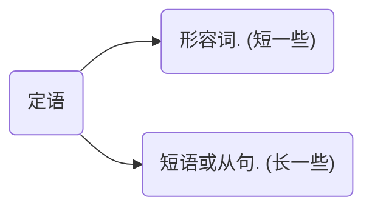

### 从句
#### 名词性从句

主要作用是将一个句子降级成名词，因为一个句子只能有一个谓语动词，用作连接句子

##### 主语从句：

`That he like football surprised us.`

名词(主语)：`That he like` 
及物动词(谓语)：`surprised`
名词(宾语): `us`

##### 宾语从句

`He said that he like football.`

名词(主语)：`He` 
及物动词(谓语)：`said`
名词(宾语): `that he like football`

##### 表语从句

`The fact is that he like football.`

名词(主语)：`The fact` 
be动词(系语)：`is`
名词(表语): `that he like football`

##### 同位语从句

同位语起解析说明名词的作用，和其解析的名词相等，同位语是[名词]。

如：

* 主语，同位语: `Yusuf, a young man, love spring.`, 解析说明名词 `Yusuf`
* 主谓宾，同位语: `Yusuf live spring, on of the four season`, 解析说明`spring`

**同位语从句只会用 that**

`The fact that he like football surprised me.`

名词(主语)：`The fact that he like football`
同位语从句：`that he like football` 
及物动词(谓语)：`surprised`
名词(宾语): `me`

```
He said the fact that he like football.
```
名词(主语)：`He`
及物动词(谓语)：`said`
名词(宾语): `the fact that he like football`
同位语从句：`that he like football` 

#### 定于从句
修饰限定名词，汉语中 "的" 前面的内容：红红的花.

结构：
定① 主语 定②  谓语  定① 宾语 定②

主语：`定① 主语 定②`
谓语：动词
宾语：`定① 宾语 定②`

**定①例子：**
`A beautiful girl shared a fantastic story.`
那个漂亮的那还分享了一个迷人的故事.

**定②例子：**
`A girl from Mars shared a story about her people.`
那个来自 Mars 的女孩分享了一个关于她的人民的故事




