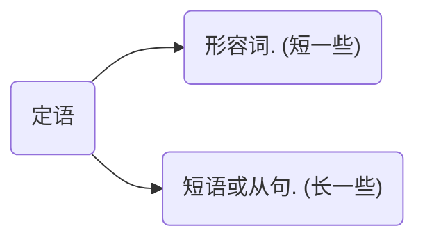

所有的句子都是 `简单句、并列句、复合句` 这三种类型

### 从句
#### 名词性从句

主要作用是将一个句子降级成名词，因为一个句子只能有一个谓语动词，用作连接句子

##### 主语从句：

`That he like football surprised us.`

名词(主语)：`That he like` 
及物动词(谓语)：`surprised`
名词(宾语): `us`

##### 宾语从句

`He said that he like football.`

名词(主语)：`He` 
及物动词(谓语)：`said`
名词(宾语): `that he like football`

##### 表语从句

`The fact is that he like football.`

名词(主语)：`The fact` 
be动词(系语)：`is`
名词(表语): `that he like football`

##### 同位语从句

同位语起解析说明名词的作用，和其解析的名词相等，同位语是[名词]。

如：

* 主语，同位语: `Yusuf, a young man, love spring.`, 解析说明名词 `Yusuf`
* 主谓宾，同位语: `Yusuf live spring, on of the four season`, 解析说明`spring`

**同位语从句只会用 that**

`The fact that he like football surprised me.`

名词(主语)：`The fact that he like football`
同位语从句：`that he like football` 
及物动词(谓语)：`surprised`
名词(宾语): `me`

`He said the fact that he like football.`

名词(主语)：`He`
及物动词(谓语)：`said`
名词(宾语): `the fact that he like football`
同位语从句：`that he like football` 

#### 定语从句
**什么是定语从句?**
修饰限定名词，汉语中 "的" 前面的内容：红红的花. (英文跟中文相反，一定注意不要头重脚轻，比较长的形容语句要放在后面)

结构：
`定①` 主语 `定②` 谓语 `定①` 宾语 `定②`

主语：`定① 主语 定②`
谓语：动词
宾语：`定① 宾语 定②`

>**定①例子：**
> A `beautiful` girl shared a `fascinating` story.
>那个漂亮的那还分享了一个迷人的故事.
>
>定语①(形容词)：`beautiful`
>主语：`a girl`
>谓语(动词)：`shared`
>定语①(形容词): `fascinating`
>宾语：`a story`

>**定②例子：**
> A girl `from Mars` shared a story `about her people.`
>那个来自 Mars 的女孩分享了一个关于她的人民的故事
>
>主语：`a girl`
>定语②(介宾短语)：`from Mars`
>谓语(动词)：`shared`
>宾语：`a story`
>定语②(介宾短语): `about her people.`

>**不定式短语例子：**
> A task `to tackle` is the `potential` crisis
>一项需要解决的任务是潜在的危机
>
>主语：`a task`
>定语②(不定式短语)：`to tackle`
>系语(Be动词)：`is`
>定语①(形容词): `potential`
>表语(名词)：`crisis`

>**定语从句例子：**
> A girl `who likes spring` shared a story `which moved us.`
>一个喜欢春天的女孩分享了一个打动了我们的故事
>
>主语：`a girl`
>定语②(定于从句)：`who likes spring`
>谓语(动词)：`shared`
>宾语：`a story`
>定语②(定于从句)：`which moved us`

>**终极例子：**
> A `beautiful` girl `from Mars` `who likes srping` shared a `fascinating` story `about her people` `which moved us`.
>一个美丽的例子火星的喜欢春天的女孩分享了一个迷人的关于她的人民的打动了我们的故事.
>
>主语：`a girl`
>定语①(形容词)：`beautiful`
>定语②(介宾短语)：`from Mars`
>定语②(定于从句)：`who likes spring`
>谓语(动词)：`shared`
>定语①(形容词): `fascinating`
>宾语：`a story`
>定语②(介宾短语): `about her people.`
>定语②(定于从句)：`which moved us`

#### 状语从句
**什么是状语：**
* 副词： 修饰动词，walk slowly (慢慢地走)。 修饰形容词或定语, slightly higher (稍微高点)、 petty tall(挺高的)
* 起副词作用的句子 --> 状语从句
* 按作用分：
  * 时间状语(从句)：何时？ 
    * 简单句：
      * He came `yestoday`
    * 从句：
      * He called me `when` I was sleeping.
  * 地点状语(从句): 在哪？ 
    * 简单句：
      * He celebrated his birthday `at school`.
    * 从句：
      * We met `where` we used to go for a walk.
  * 原因状语(从句): 为啥？因为... 
    * 简单句：He like spring `for` its beauty. 
    * 从句(除了since前后都可以之外，其他的都靠后)：
      * He likes spring `for` it is beautiful. 
      * He like spring `because` it is beautiful. 
      * He like spring `as` it is beautiful. 
      * He like spring `since` it is beautiful. 
  * 条件状语(从句): 在什么情况下？如果..； 只要...; 只有... 
    * `If` you win, there will be a reward. 
    * `As long As you` win, there will be a return
  * 目的状语(从句): 为啥？为了...; 怎样才能.... 
    * 简单句：
      * I study `for` my well-being. 
      * I don't spend `extra` to save money.
      * I don't spend `in order to` save money.
    * 从句： 
      * I don't spend `so that` I can save money.
  * 结果状语(从句): 导致了啥？结果...; 以至于...
    * He tried `so` hard `that` he finally succeeded.
  * 让步状语(从句): 转折的前奏: 虽然...
    * `Although you have a point there, I don't agree with your proposal`
  * 方式状语(从句): 怎么做的/发生的？用...；通过...
    * 简单句：
      * I learn English `through` an online course.
      * I contact my friends `via` Wechat.
      * I draw `with` my pen.
      * I found differences `by` contrasting the two.
    * 从句：
      * She looks at me `as if` she knows me.
      * He finished the work `as` I told him to.

**PS: 状语从句是存在于简单句(主谓宾)之外的.**

他昨天为了庆祝生日在车库里举办了一个生日派对，虽然他都快没钱了.
`He held a birthdayparty yestoday in the carport in order to celebrate his birthday, although he is almost out of money.`

